This project implements a classic 3-tier web architecture deployed on AWS EC2 instances within a VPC.


# 🚀 3-Tier AWS Architecture Deployment Guide

This guide provides a comprehensive walkthrough for deploying a 3-tier application on AWS EC2, including a web server (Nginx), an application server (Node.js), and a database server (MySQL).

---

## 🏗️ Architecture Overview

The application is structured into three distinct layers:
1.  **Web Layer**: Nginx serving as a reverse proxy.
2.  **App Layer**: Node.js backend processing logic.
3.  **Data Layer**: MySQL database for persistent storage.

---

## 🛠️ Complete Deployment Commands

### 1️⃣ Connect to Web Server
Establish a secure connection to your public-facing web server.

```bash
ssh -i absjm.pem ubuntu@WEB_SERVER_PUBLIC_IP
```
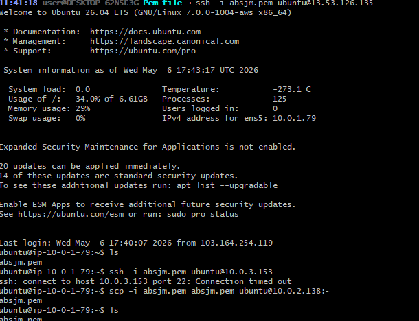

---

### 2️⃣ Install Nginx on Web Server
Update the system and install the Nginx web server to handle incoming traffic.

```bash
sudo apt update
sudo apt install nginx -y
```
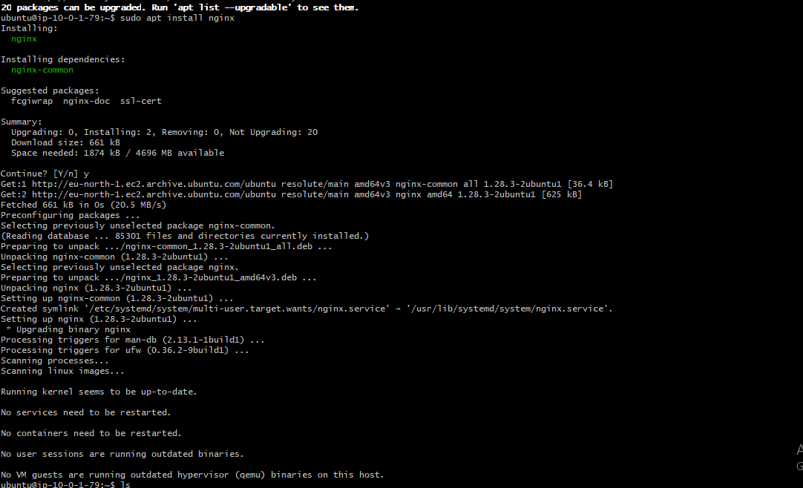

**Check Nginx Status:**
```bash
sudo systemctl status nginx
```
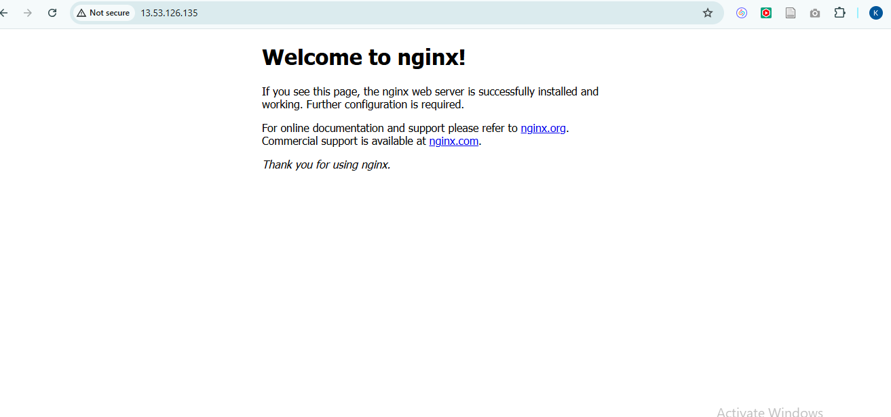

**Management Commands:**
```bash
sudo systemctl enable nginx
sudo systemctl restart nginx
```

---

### 3️⃣ Copy PEM File to App Server
Securely transfer your private key to the application server to allow internal SSH access.

```bash
scp -i absjm.pem absjm.pem ubuntu@APP_SERVER_PRIVATE_IP:~
```
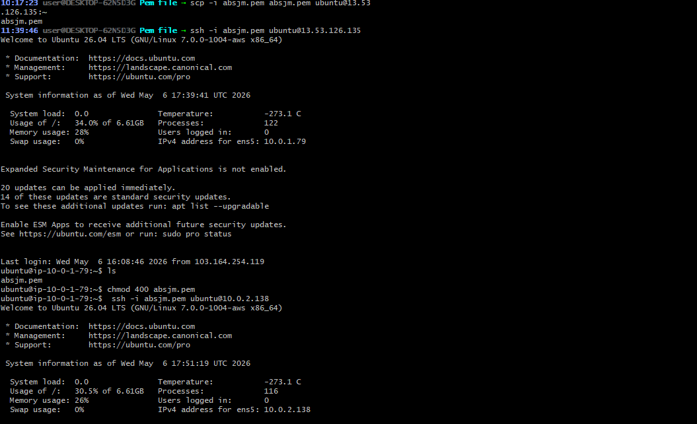

---

### 4️⃣ Connect to App Server from Web Server
Jump from the web server to the application server located in the private subnet.

```bash
chmod 400 absjm.pem
ssh -i absjm.pem ubuntu@APP_SERVER_PRIVATE_IP
```
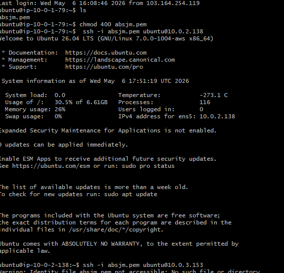

---

### 5️⃣ Install Node.js on App Server
Set up the runtime environment for the backend application.

```bash
sudo apt update
sudo apt install nodejs npm -y
```

**Verify Versions:**
```bash
node -v
npm -v
```
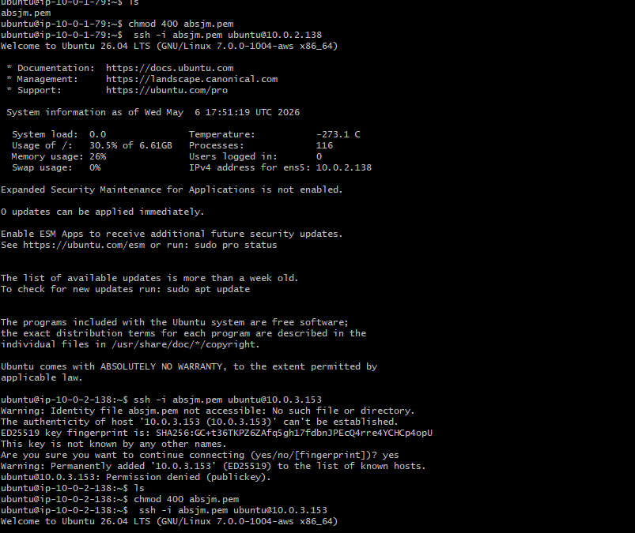

---

### 6️⃣ Create Backend Application
Initialize the project and install necessary dependencies for the Express server.

```bash
mkdir backend
cd backend
npm init -y
npm install express mysql2 cors
nano app.js
```

**Run Backend:**
```bash
node app.js
```
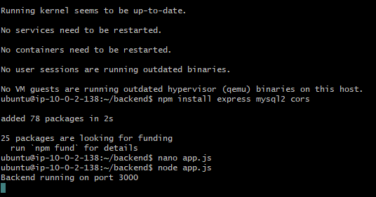

---

### 7️⃣ Connect to DB Server from App Server
Move deeper into the architecture to configure the database layer.

```bash
ssh -i absjm.pem ubuntu@DB_SERVER_PRIVATE_IP
```
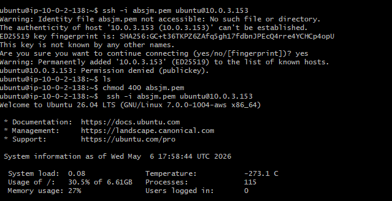

---

### 8️⃣ Install MySQL on DB Server
Deploy the MySQL database engine.

```bash
sudo apt update
sudo apt install mysql-server -y
```
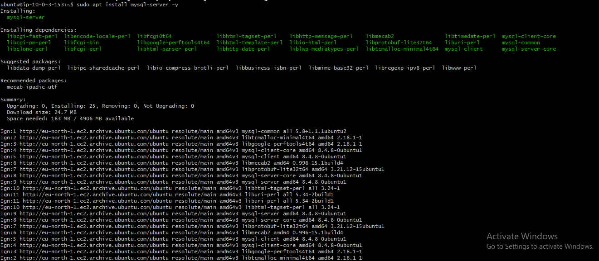

---

### 9️⃣ Configure MySQL Database
Initialize the schema and set up user permissions.

```sql
CREATE DATABASE appdb;
CREATE USER 'appuser'@'%' IDENTIFIED BY 'password';
GRANT ALL PRIVILEGES ON appdb.* TO 'appuser'@'%';
FLUSH PRIVILEGES;
EXIT;
```
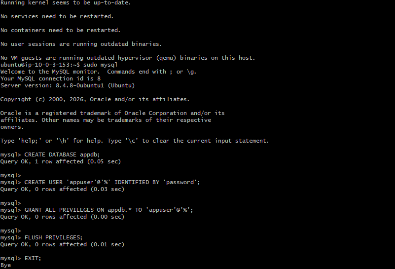

---

### 🔟 Enable Remote MySQL Access
Configure MySQL to listen for connections from the application server.

```bash
sudo nano /etc/mysql/mysql.conf.d/mysqld.cnf
```
**Change:** `bind-address = 0.0.0.0`

```bash
sudo systemctl restart mysql
```
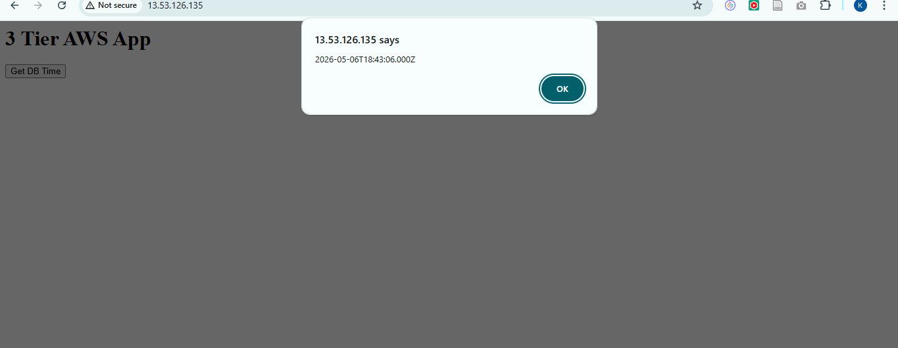

---

### 1️⃣1️⃣ Configure Nginx Reverse Proxy
Route `/api` traffic to the backend server and serve the frontend locally.

```bash
sudo nano /etc/nginx/sites-available/default
```

**Configuration Block:**
```nginx
server {
    listen 80;
    root /var/www/html;
    index index.html;

    location / {
        try_files $uri /index.html;
    }

    location /api {
        proxy_pass http://APP_SERVER_PRIVATE_IP:3000;
        proxy_set_header Host $host;
        proxy_set_header X-Real-IP $remote_addr;
    }
}
```

---

### 1️⃣2️⃣ AWS Networking Configuration
Proper route table configuration is critical for connectivity between subnets and the internet.

#### Public Route Table
`0.0.0.0/0 → Internet Gateway`

#### Private Route Table
`0.0.0.0/0 → NAT Gateway`

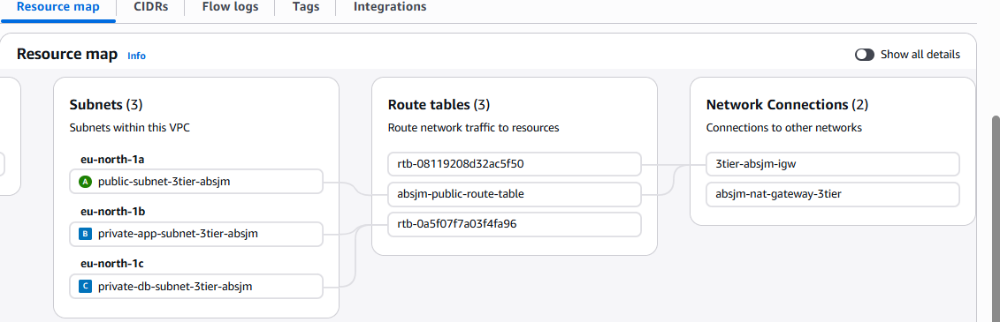

---

### 1️⃣3️⃣ Security Group Rules
Strict firewall rules to ensure only authorized traffic flows between tiers.

| Tier | Port | Source | Description |
|------|------|--------|-------------|
| **Web** | 80 | 0.0.0.0/0 | Public HTTP |
| **Web** | 22 | My IP | Admin SSH |
| **App** | 3000 | Web-SG | Backend API |
| **App** | 22 | Web-SG | Internal SSH |
| **DB** | 3306 | App-SG | MySQL Access |
| **DB** | 22 | App-SG | Internal SSH |

---

### ✅ Final Result
Successfully deployed a resilient 3-tier application utilizing:
- **AWS EC2** (Compute)
- **Nginx** (Web Proxy)
- **Node.js** (Backend)
- **MySQL** (Database)
- **Networking**: VPC, NAT Gateway, Internet Gateway, Route Tables, and Security Groups.